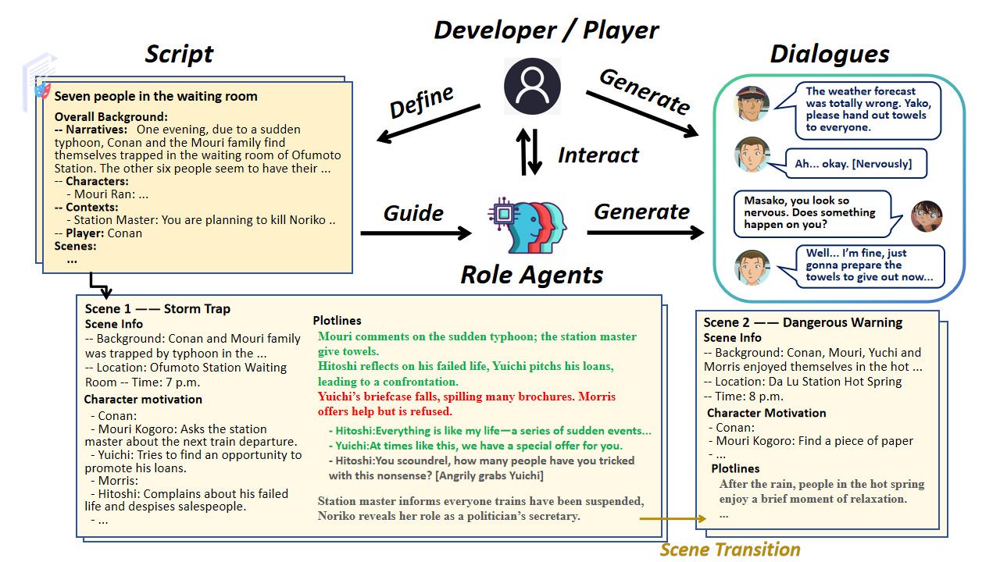
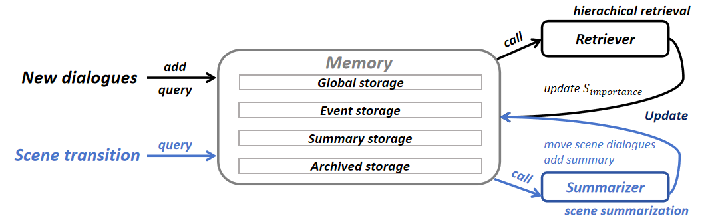

# 🎭 OPEN-THEATRE

<div align="center">

[](https://opensource.org/licenses/MIT)
[](https://www.python.org/downloads/)
[](https://www.youtube.com/watch?v=vjM_xrNIoM8)

**An Open-Source Toolkit for LLM-based Interactive Drama**

*Code repository for the paper "OPEN-THEATRE: An Open-Source Toolkit for LLM-based Interactive Drama"*

[📄 Paper (arXiv)](https://arxiv.org/abs/2509.16713)
[🎬 Demo Video](https://www.youtube.com/watch?v=vjM_xrNIoM8) • [🚀 Quick Start](#quick-start) • [🏗️ Architecture](#architecture)

</div>

---

## 📖 Overview

**OPEN-THEATRE** is a cutting-edge, open-source toolkit that revolutionizes interactive drama creation through advanced Large Language Model (LLM) architectures. Our system enables dynamic storytelling with intelligent character interactions, sophisticated memory systems, and multiple AI coordination strategies.

### 🌟 Key Highlights

- 🎯 **Multiple AI Architectures**: Four distinct coordination strategies for different storytelling needs
- 🧠 **Advanced Memory System**: Sophisticated character memory with retrieval-augmented generation (RAG)
- 🎭 **Intelligent Character Agents**: Autonomous player agents with customizable personas
- 🌐 **Modern Web Interface**: Intuitive, responsive UI for seamless interaction
- 🔧 **Extensible Framework**: Modular design supporting multiple LLM providers


*Figure 1: A demonstration of LLM-based interactive drama. The script is adapted from the popular anime Detective Conan.*

---

## 🏗️ Architecture

### 🎪 AI Coordination Architectures

Our toolkit supports four distinct AI architectures, each optimized for different storytelling scenarios:

| Architecture | Mode | Description | Best For |
|-------------|------|-------------|----------|
| 🎯 **One-for-All** | `v1` | Single LLM manages all characters | Simple scenarios, consistent tone |
| 🎬 **Director-Actor（one action per round）** | `v2` | Separate director and character LLMs | Complex multi-character scenes |
| 🎬 **Director-Actor (allow multiple actions per round)** | `v2_plus` | Separate director and character LLMs | Complex multi-character scenes |
| 🌐 **Director-Global-Actor** | `v2_prime` | Director with one global actor LLM | Large-scale narratives |

### 🧠 Memory System Architecture


*Figure 2: Hierarchical Memory Architecture. New dialogues are ingested into the Event Store and call the retriever to query all stores. The scene transition signal calls the summarizer module to create new entries in the Summary Store and move original records to the Archive Store, completing the memory lifecycle.*

Our sophisticated memory system features:
- **📚 Hierarchical Memory Storage**: Four specialized stores (Global, Event, Summary, Archive) organize memory for efficient, scene-based, and character-specific recall.
- **🔍 Dynamic Semantic Retrieval**: A unique scoring model combines hybrid relevance (lexical + semantic) with dynamic importance, ensuring highly relevant memory recall. 
- **📝 Memory Summarization**: Our summarizer actively manages cognitive load through memory consolidation, generating abstractive summaries of completed scenes, and moving original detailed records to an long-term archive. 
---

## 🚀 Quick Start

### 📋 Prerequisites

- Python 3.12
- LLM API access (Azure OpenAI, OpenAI, or DeepSeek)

### ⚡ Installation

1. **Clone the repository**
   ```bash
   git clone https://github.com/your-username/Open-Theatre.git
   cd Open-Theatre
   ```

2. **Install dependencies**
   ```bash
   pip install -r requirements.txt
   ```

3. **Configure environment**
   ```bash
   cp .env.example .env
   # Edit .env with your API keys
   ```

4. **Launch the backend (API + static files)**
  ```bash
  # From the repository root
  python main.py
  ```

5. **Start the frontend (development)**

  The web UI lives in the `frontend/` folder. In a separate terminal, run:

  ```bash
  cd frontend
  npm install
  npm run dev
  ```

  - `npm run dev` starts Vite's dev server (hot reload). By default it serves on `http://127.0.0.1:5173` (Vite) while the backend runs on port `3000`.
  - If you prefer the backend to serve a built frontend, run a production build and copy the output into the repo root (or serve from `frontend/dist`):

  ```bash
  cd frontend
  npm run build
  # then open the built `index.html` in `frontend/dist` or configure your backend to serve it
  ```

### 🎬 Demo Video

Watch our comprehensive setup and usage demo: [**YouTube Demo**](https://www.youtube.com/watch?v=vjM_xrNIoM8)

---

## 🎮 User Interface


*Figure 3: Modern, intuitive web interface for interactive drama creation and management*

### 🎨 Interface Features

- **📝 Script Editor**: Visual script creation with drag-and-drop components
- **👥 Character Manager**: Comprehensive character profile and avatar management
- **🎬 Scene Designer**: Interactive scene creation with motivation and plotline tools
- **💬 Real-time Chat**: Dynamic conversation interface with character responses
- **📊 Analytics Dashboard**: Performance metrics and interaction statistics
- **🎯 Memory Viewer**: Real-time memory state visualization

---

## 🔧 Configuration

### 🌐 LLM Provider Setup

Configure your preferred LLM provider in `.env`:

```env
# Choose your provider: azure_openai, openai, deepseek
LLM_PROVIDER=azure_openai

# Azure OpenAI Configuration
AZURE_API_KEY=your_azure_api_key
AZURE_ENDPOINT=https://your-instance.openai.azure.com/
AZURE_DEPLOYMENT=gpt-4o
AZURE_API_VERSION=2024-08-01-preview

# OpenAI Configuration
OPENAI_API_KEY=your_openai_api_key
OPENAI_BASE_URL=https://api.openai.com/v1
OPENAI_MODEL=gpt-4o

# DeepSeek Configuration
DEEPSEEK_API_KEY=your_deepseek_api_key
DEEPSEEK_API_URL=https://api.deepseek.com
DEEPSEEK_MODEL=DeepSeek-V3

# System Configuration
ENGLISH_MODE=true #Chinese mode if false (only for prompt, ui is all in Chinese now)
STORAGE_MODE=true #whether to start with memory system
```

---

## 💻 Computer / Configuration (recommended)

Minimum recommendations to run the project and the frontend smoothly:

- OS: Linux / macOS / Windows (Linux recommended for GPU setups)
- Python: 3.10+ (repo targets Python 3.12 in badges). Use Conda or pyenv to manage environments.
- Node: 18.x or later, npm: 8.x or later (required to run the frontend dev server and build with Vite)
- npm packages: run `npm install` in `frontend/` before `npm run dev`
- Optional GPU (for local model hosting / heavy LLMs): NVIDIA GPU with CUDA 11.8+ recommended. If you plan to use GPU-accelerated libraries (PyTorch, FlashAttention, Apex), install matching CUDA toolkit and drivers.

Notes:
- Backend: the backend uses FastAPI and is started with `python main.py`, which launches Uvicorn and binds to `0.0.0.0:3000` by default. If you run the backend this way you can open `http://127.0.0.1:3000` to access the served `index.html` (if the static frontend files are present) or use the frontend dev server.
- Frontend: the `frontend/` folder contains a Vite React app. Use `npm run dev` for development (hot reload) or `npm run build` to create a production bundle in `frontend/dist`.


## 🤖 PlayerAgent System

### 🎯 Intelligent Player Simulation

Our **PlayerAgent** system provides autonomous player simulation with sophisticated decision-making capabilities:

```python
import asyncio
from player_agent import PlayerAgent

async def demo_intelligent_player():
    # Initialize PlayerAgent with specific persona
    agent = PlayerAgent(llm_provider="azure_openai")

    # Run automated session with intelligent interactions
    records = await agent.auto_play_session(
        script_path="script/Romeo and Juliet_eng.yaml",
        mode="v2_plus",
        num_interactions=10,
        persona_type="university_student",  # Specific character persona
        use_intelligent_interaction=True
    )

    # Export detailed interaction records
    export_path = agent.export_records("romeo_juliet_session.json")
    print(f"Session exported to: {export_path}")

asyncio.run(demo_intelligent_player())
```

### 🎭 Persona-Based Interactions

Choose from 10 distinct predefined personas, each with unique characteristics and interaction patterns:

| Persona | Age | Background | Key Traits | Interaction Style | Example Response |
|---------|-----|------------|------------|-------------------|------------------|
| 🎓 **University Student** | 20 | Computer Science major | Curious, open-minded, tech-savvy | Collaborative, questioning, uses youthful language | *"This is quite complex, let me think... Maybe we should work together on this."* |
| 💼 **Office Worker** | 28 | 5-year corporate employee | Stable, practical, conflict-averse | Formal, analytical, team-oriented | *"We need to analyze this situation rationally and form a plan."* |
| 👨‍🏫 **Retired Teacher** | 65 | 40-year Chinese teacher | Wise, gentle, traditional | Patient, guidance-focused, quotes wisdom | *"This reminds me of an old saying... we must not be impetuous."* |
| 💻 **Freelancer** | 30 | Design & writing professional | Independent, creative, idealistic | Innovative, open-minded, artistic | *"Let me look at this from a different angle; maybe we can find breakthroughs."* |
| 📚 **High School Student** | 17 | Pre-college student | Smart, rebellious, pop culture fan | Casual, questioning authority, anime references | *"This is so weird... Kinda like an anime plot, but not exactly."* |
| 🕵️ **Cynical Observer** | 35 | Freelance writer | Pessimistic, skeptical, independent | Sarcastic, questioning, detached | *"Heh, don't tell me you actually believe that."* |
| ⚡ **Impatient Executive** | 40 | Corporate high-level manager | Decisive, efficiency-focused, results-driven | Direct, assertive, time-conscious | *"Stop wasting time. How exactly are we going to solve this?"* |
| 🔍 **Conspiracist** | 32 | Conspiracy theory enthusiast | Distrustful, pattern-seeking, suspicious | Provocative, theory-building, authority-questioning | *"There's definitely something fishy going on behind this."* |
| ⚖️ **Argumentative Debater** | 25 | Law graduate | Meticulous, eloquent, competitive | Confrontational, logic-focused, debate-seeking | *"Your logic doesn't hold up; it simply can't withstand scrutiny."* |
| 😤 **Emotional Impulsive** | 19 | Young adult | Emotional, reactive, direct | Impulsive, unfiltered, mood-driven | *"Ugh, this is so annoying! When will this finally end?!"* |

### 🎯 Persona Selection

```python
# Choose specific persona for targeted interactions
agent = PlayerAgent(llm_provider="azure_openai")
await agent.auto_play_session(
    script_path="script/Romeo and Juliet_eng.yaml",
    persona_type="university_student",  # Or any of the 10 available personas
    use_intelligent_interaction=True
)
```

### 📊 Performance Analytics

```python
# Get detailed statistics
stats = agent.get_statistics()
print(f"Success Rate: {stats['success_rate']}%")
print(f"Average Response Time: {stats['average_response_time']}s")
print(f"Total Interactions: {stats['total_interactions']}")
```

---

## 🎨 Script Creation

### 📝 YAML-Based Script Format

Create rich, interactive stories using our intuitive YAML format:

```yaml
id: Romeo and Juliet
background:
  player: Romeo
  narrative: |
    The story revolves around Romeo, the only son of the Montague family. 
  characters:
    Romeo: The only son of the Montague family, emotionally rich and conflicted, often troubled by his family’s feuds and his love life.
    Montague: A serious and resilient middle-aged man, Romeo’s father, the leader of the Montague family, long-time enemy of the Capulet family.
    Lady Montague: Gentle and kind, Romeo’s mother, deeply concerned about her son’s emotional changes.
    Benvolio: Calm, kind, and helpful, a peacekeeper who adheres to rules, Romeo’s cousin and thoughtful friend.
    Juliet: Romeo’s love interest, the only daughter of the Capulet family, intelligent and strong but also troubled by the family feud.
scenes:
  scene1:
    name: Dawn in Verona Square
    mode: v1
    scene: Location:Verona Square. Time:10 AM. Romeo is walking alone, trying to clear his mind, and spots his parents—the Montague couple. 
    characters:
      Romeo: 
      Montague: Aware of the ongoing conflict with the Capulet family’s servants, concerned about Romeo’s mood, asks Benvolio to talk to him.
      Lady Montague: Aware of the ongoing conflict with the Capulet family’s servants, concerned about Romeo’s mood, asks Benvolio to talk to him.
      Benvolio: Resolves the dispute between the Montague and Capulet servants, tries to console Romeo.
    chain:
    - The Montagues and Benvolio meet in the square, Montague asked Benvolio to console Romeo.
    - Benvolio talks to Romeo about his emotional troubles.
    - Romeo and Benvolio discuss whether he is too obsessed with his feelings.
    stream:
      The Montagues and Benvolio meet in the square, Montague asked Benvolio to console Romeo.:
        - Montague:(angrily adjusting his sleeves) Who started this again? Who is rekindling the feud between our families this early in the morning?
        - Benvolio:I saw their servants fighting as soon as I arrived. I had to step in to separate them.
      Benvolio talks to Romeo about his emotional troubles.:
        - Benvolio:Romeo. I heard you’ve been troubled by matters of the heart. How are you now?
        - Romeo:(pauses, sighs) I... I am consumed by love, unable to escape this pain. She won’t look at me.
```

### 🎬 Scene Management

- **🎯 Flexible Modes**: Choose optimal AI architecture per scene
- **📋 Character Motivations**: Scene-specific character goals and behaviors
- **📖 Plotline Tracking**: Multi-threaded story progression
- **🔄 Dynamic Transitions**: Intelligent scene flow management

---

### 🧩 Modular Architecture

```
Open-Theatre/
├── 🎭 frame.py              # Core drama engine
├── 🤖 player_agent.py       # Intelligent player simulation
├── 🧠 memory/               # Advanced memory system
├── 🎨 components/           # Frontend components
├── 📝 script/               # Story scripts
├── 🎯 prompt/               # LLM prompts
└── 🔧 models.py             # Multi-provider LLM management
```

---

## 🚀 Advanced Features

### 🧠 Advanced Memory Features

```python
# Configure memory system parameters in memory/base.py
LAYER_WEIGHTS = {
    "global": 1.0,
    "event": 1.0,
    "summary": 1.0,
}
TAG_WEIGHTS = {
    # setting layer
    "profile": 1.5,
    "scene_init": 1.3,
    "scene_objective": 1.4,

    # event_raw layer
    "conversation": 1.0,

    # event_summary layer
    "summary_conversation": 1.2,
    "summary_scene_init": 1.1,
    "summary_scene_objective": 1.3,

    # archived layer
    "archived_conversation": 0.2, 
    "archived_scene_init": 0.1,
    "archived_scene_objective": 0.1,
}
TAG_EMBEDDING_WEIGHT = 0.0
TEXT_WEIGHT = 1.0
IMPORTANCE_ADDITION_WEIGHT = 0.05
IMPORTANCE_ADDITION_THRESHOLD = 10
```

### 🌐 Multi-Language Support

- 🇺🇸 **English Mode**: Full English language support
- 🇨🇳 **Chinese Mode**: Native Chinese language processing
- 🔄 **Dynamic Switching**: Runtime language mode changes

---

## 🤝 Contributing

We welcome contributions from the community! If you have any questions or suggestions, please open an issue or contact us directly.

### 📋 Contribution Guidelines

1. **🐛 Bug Reports**: Use GitHub Issues with detailed reproduction steps
2. **✨ Feature Requests**: Propose new features with use cases and examples
3. **🔧 Pull Requests**: Follow our coding standards and include tests
4. **📖 Documentation**: Help improve documentation and examples

### 🎯 Areas for Contribution

- 🧠 **Memory System Enhancements**: Advanced retrieval algorithms
- 🎭 **New Character Archetypes**: Expand personality models
- 🌐 **Language Support**: Additional language implementations
- 🎨 **UI/UX Improvements**: Enhanced user interface features
- ...


---

## 📞 Support
- **📧 Email**: [johnnie.walker@sjtu.edu.cn](mailto:johnnie.walker@sjtu.edu.cn)
- **🐛 Issues**: [GitHub Issues](https://github.com/your-username/Open-Theatre/issues)
- **📖 Wiki**: [Community Wiki](https://github.com/your-username/Open-Theatre/wiki)

---

## 📜 License

This project is licensed under the **MIT License** - see the [LICENSE](LICENSE) file for details.

```
MIT License

Copyright (c) 2024 OPEN-THEATRE Contributors

Permission is hereby granted, free of charge, to any person obtaining a copy
of this software and associated documentation files (the "Software"), to deal
in the Software without restriction, including without limitation the rights
to use, copy, modify, merge, publish, distribute, sublicense, and/or sell
copies of the Software, and to permit persons to whom the Software is
furnished to do so, subject to the following conditions:

The above copyright notice and this permission notice shall be included in all
copies or substantial portions of the Software.
```

---

<div align="center">

**🎭 OPEN-THEATRE** - *Revolutionizing Interactive Drama with AI*

[](https://github.com/johnnie193/Open-Theatre/stargazers)
[](https://github.com/johnnie193/Open-Theatre/network/members)

[⭐ Star us on GitHub](https://github.com/johnnie193/Open-Theatre) • [🎬 Watch Demo](https://www.youtube.com/watch?v=vjM_xrNIoM8)

</div>
